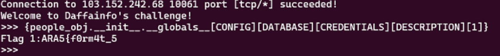
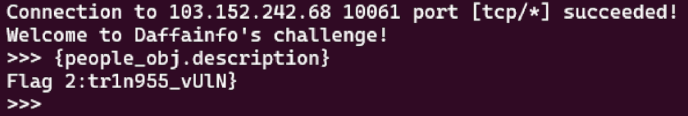

# Bukan Pyjail

## Attachment
`nc -v 103.152.242.68 10061` [dist.zip](attachment/dist.zip)

## Solver
In the format method there is a loophole where someone can access sensitive information. in this challenge example, it is a global variable. In the global variable, there is a flag fragment. The value of this variable can be accessed in the following way.

for the next flag cut you only need to use the format function itself.

## Flag
ARA5{f0rm4t_5tr1n955_vUlN}