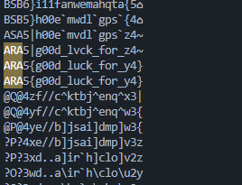

# Mandarin Class from wish

## Attachment
[chall.py](attachment/chall.py) 

## Solver
Given the chall.py file which contains classic encryption, it is known that the flag has been changed to decimal form then multiplied by a key and changed again to chr form to form Chinese writing. The solution is that we must first know the key to convert it to its original text form, namely by taking the initial character and converting it to decimal, after that subtracting the decimal from 65, namely chr A, because A is the initial character of the flag format. Finally found the key is 234, just create the solver.

``` python
enc_flag = "㭪䫴㭪ひ灮带⯠⯠孨囖抸櫲婾懎囖崼敶栴囖溚⾈牂"
flag = ""

x = 234
for i in enc_flag:
    flag_enc = chr(ord(i) // x)
    flag += flag_enc

print(flag)
```


and actually there is a lazy way, namely by doing bruteforce on the decimal, because the random range is not that big.

``` python
enc_flag = "㭪䫴㭪ひ灮带⯠⯠孨囖抸櫲婾懎囖崼敶栴囖溚⾈牂"

for i in range(1, 500):
    flag = ""
    for data in enc_flag:
        flag += chr(ord(data) // i)
    print(flag)
```


## Flag
ARA5{g00d_luck_for_y4}