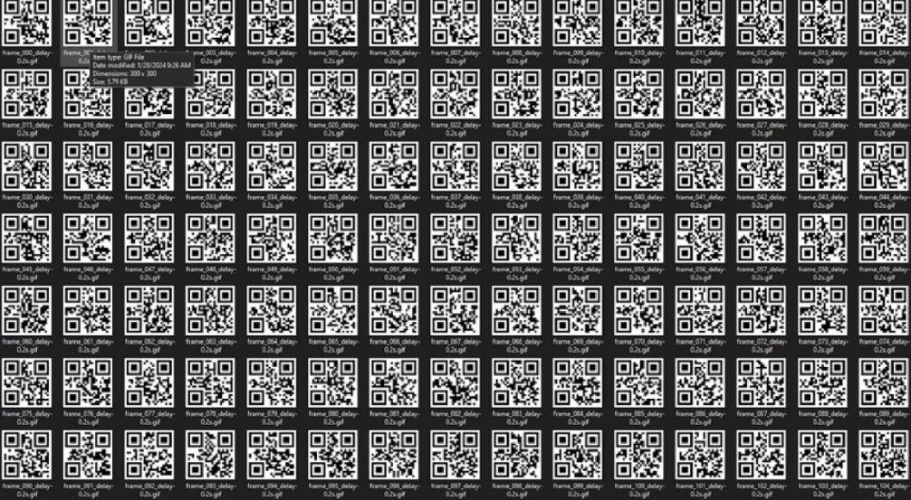

# The QRazy Spell

## Attachment
[TheBookOfMagick.jpg](attachment/TheBookOfMagick.jpg)

## Solver

Given a jpg in the form of an image of an item from the Minecraft game, we can immediately use online tools to carry out the analysis.


We just download the file and we get a `gif` in the form of a QR code


then we just look for online tools to separate the `gif` per frame.



and now we create an automation scan script on these images.

```python
from PIL import Image
from pyzbar.pyzbar import decode

text = ""
for i in range(306):
    if i < 10:
        i_str = "00"+str(i)
    elif i < 100:
        i_str = "0"+str(i)
    else :
        i_str = str(i)
    decoded_data = decode(Image.open('frame_' + i_str + '_delay-0.2s.gif'))[0].data.decode()
    text += decoded_data
print(text)
```


Finally found a link to a media share that had a password. in the link we found an image, and we just went straight to the image, then we used the same tools to analyze the file, and found the flag in the steg.


## Flag
ARA5{t3chn0bl4d3_nev4h_d13s}