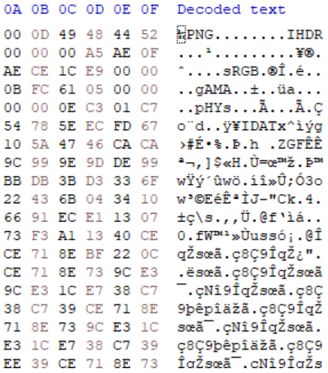
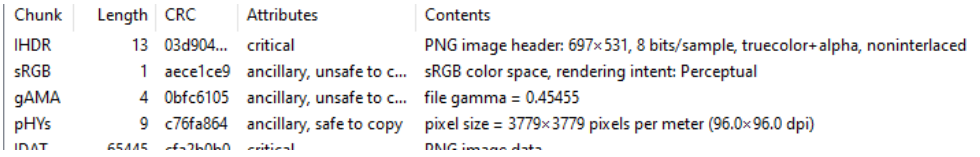
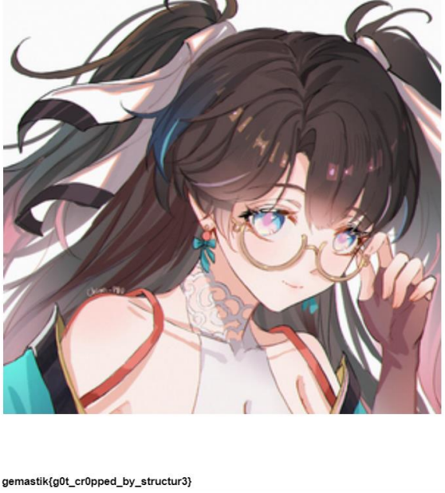

# Baby Structure

## Attachment
[zhezhi_______.zip](attachment/zhezhi_______.zip)

## Solver
Given a file attachment with the description: my friend sent me a picture, but he said the picture was accepted 'cut'. can you recover it?

After viewing it using hexdump, it was found that the file contained a PNG signature, straight away 
Let's just change the file format.

After analyzed the photo with the tweakPNG tool, there was a chunk error.

then I tried to change the size of the PNG, and set the Flag.

## Flag
gemastik{g0t_cr0pped_by_structur3}