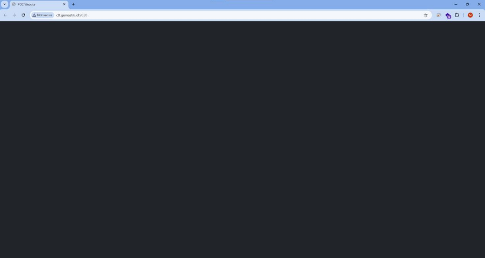
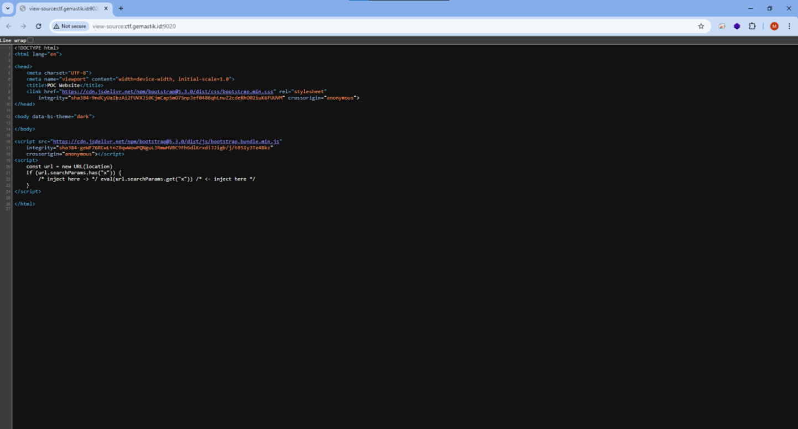
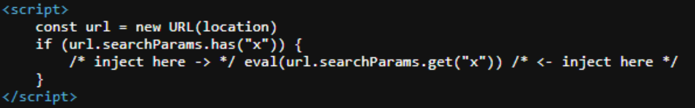
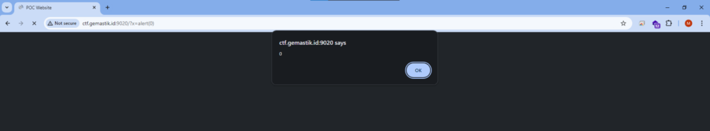
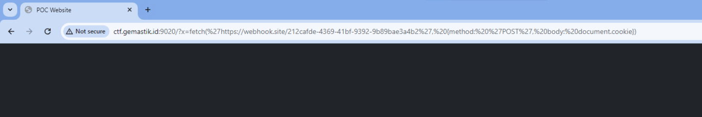
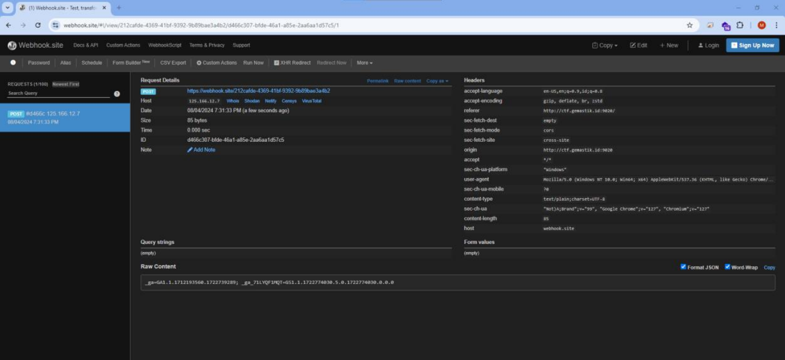
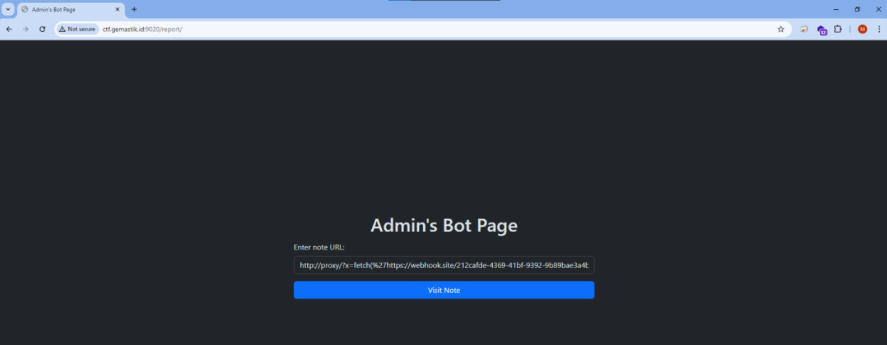
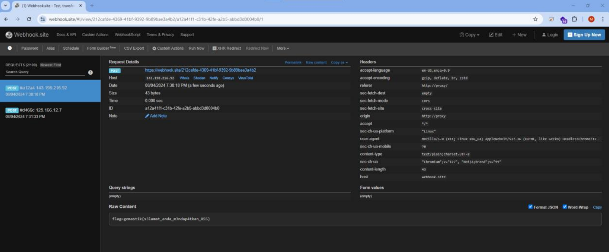

# Baby XSS

## Attachment
[ctf.gemastik.id:9020](http://ctf.gemastik.id:9020)

## Solver
Open the challenge link.

Just do “View page source”

There is a suspicious javascript code

This code will execute code on query parameter x. This is one example.

Immediately we create a payload to take the cookie and send it to a webhook.

Then you will get results like this.

Finally, to get the flag you can do this by sending the url and payload via the bot admin. Don't forget to change the host from "ctf.gemastik:9020" to "proxy".

## Flag
gemastik{s3lamat_anda_m3ndap4tkan_XSS}
